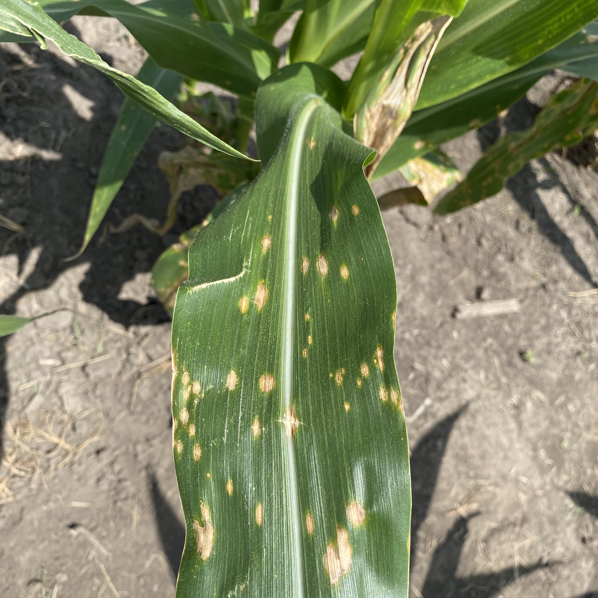
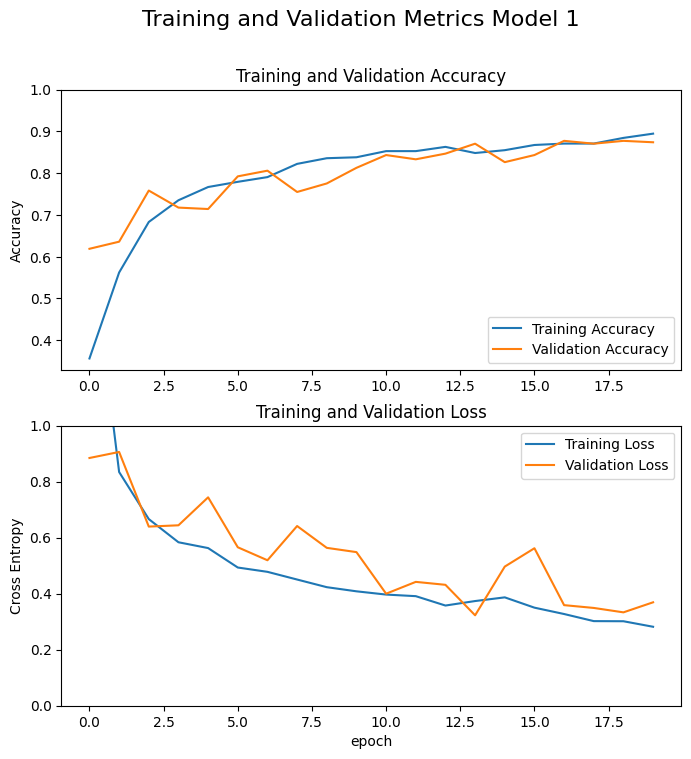
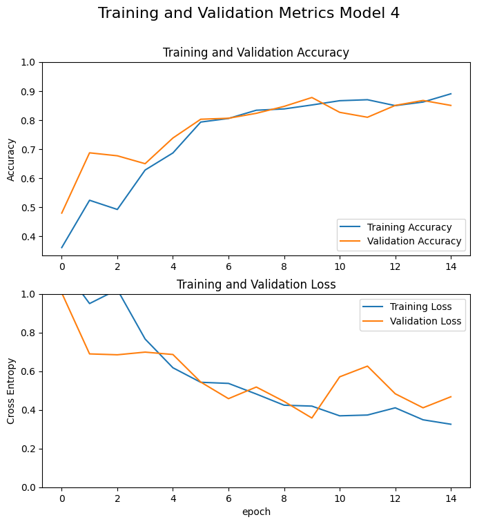
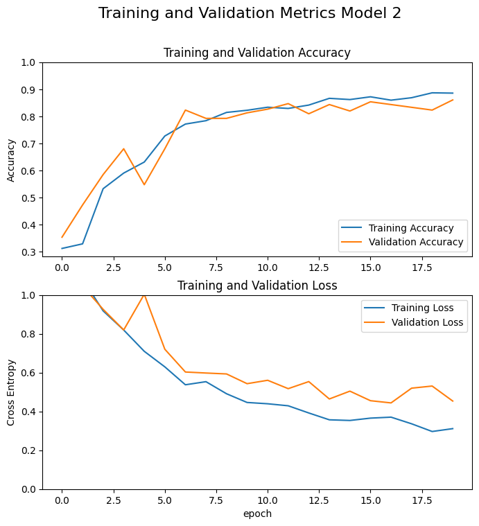
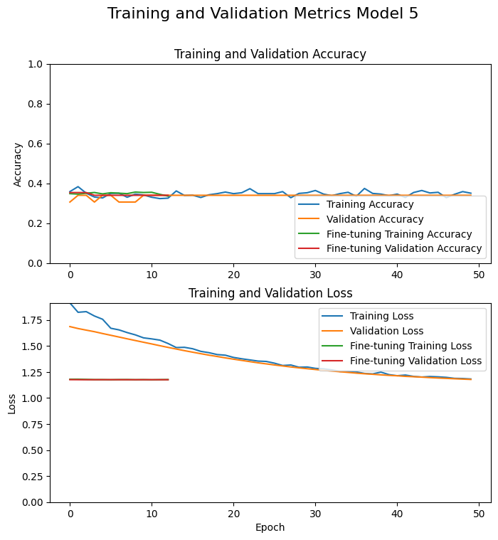

# ML2Project

This Git repository was created as part of the ML2 module exams at the ZHAW by Flavio Gottardo

## Instructions for Students

Fork this repository into your Git and clone it to your computer. You will then find detailed instructions for this project in the notebook [FollowMe](FollowMe.ipynb).

## 1. Project Motivation

Agricultural productivity is the backbone of global food security, and maize is one of the world's most important crops. However, maize crops are constantly threatened by various diseases that can severely affect yield and quality. This is where the classification of maize diseases becomes crucial.

### Accurate disease classification in maize is important for several reasons:

**1. increasing crop yield:**
early and accurate identification of diseases enables timely intervention, which can significantly reduce crop losses. By accurately classifying diseases, farmers can apply targeted treatments, ensuring healthier harvests and higher yields.

**2. sustainable agriculture:**
disease classification helps in the adoption of sustainable farming practices. By understanding the specific diseases that affect corn, researchers and farmers can develop environmentally friendly treatments that reduce reliance on chemical pesticides and promote biodiversity.

**3. economic impact:**
Corn is an important economic crop for many countries. Proper disease management through accurate classification can prevent devastating economic losses, ensure the stability of the agricultural sector and secure farmers' livelihoods.

**4. promotion of scientific research:**
Disease classification of maize is essential for scientific research and contributes to the development of resistant plant varieties. This research is critical to long-term food security, especially in the face of climate change and evolving pathogens.

**5. global food security:**
Maize is a staple food for millions of people around the world. Effective disease management ensures a steady supply of this important crop and plays a critical role in combating hunger and ensuring food security worldwide.

In summary, the classification of diseases in maize is not just a scientific endeavor, but a task with far-reaching implications for agriculture, the economy and global food security. By investing in advanced data science techniques for maize disease classification and management, we can pave the way for a more resilient and sustainable future.

## 3. Data Collection or Generation

Dataset Source: [OSF](https://osf.io/s6ru5/files/osfstorage#) **Important: _only download "Dataset_Original" Folder from "CD&S" Folder._**

**Classification of Corn Diseases**

The idea of the Project is to detect what of a given corn disease is present.
I have a Dataset available in which three diseases are Classified as following:

**gls:** Gray Leaf Spot, Total number of images: 523

**nlb:** Northern Leaf Blight, Total number of images: 497

**nls:** Northern Leaf Spot, total number of images: 551

A detailed description of the entire data set can be found in the [CD&S DATASET PREPRINT](https://arxiv.org/pdf/2110.12084v1).

## 4. Modeling

I have created a [Python file](dataPreparation.py) which loads the training, validation and test data for all models and provides me with the data augmentation.

In the course of my project I developed 5 models versions which can be found in the notebook [MyCnnModel](MyCnnModel.ipynb).

I started with a simple CNN from Keras which contains 10 layers.

### 1. Model 1

Model 1 was my initial model. It consisted of:

- An input layer to define the image dimensions.
- A data augmentation layer to increase training data diversity.
- Three convolutional layers with ReLU activation to extract features.
- Two max-pooling layers to reduce spatial dimensions.
- A flatten layer to convert data into a 1D array.
- A dense layer with 64 neurons for feature processing.
- An output layer for classification into 3 classes.
- Model 2

### 2. Model 2

For Model 2, I made the following adjustments:

- Added three dropout layers to prevent overfitting.
- Expanded the filter size in the last convolutional layer from 64 to 128 filters.
- Enhanced the dense layer from 64 to 128 neurons.
- Implemented Softmax activation for multi-class classification in the output layer.

### 3. Model 3

For Model 3, further enhancements included:

- Added kernel regularization (L2) to all convolutional and dense layers to reduce overfitting.
- Increased the filter size in the final convolutional layer to 256 filters.
- Expanded the dense layers to include an additional dense layer with 256 neurons.
- Incorporated a 0.5 dropout rate for the dense layers to further prevent overfitting.

### 4. Model 4

For Model 4 and my Final model, I implemented these modifications:

- Removed kernel regularization (L2) to simplify the model.
- Added a learning rate schedule (ExponentialDecay) to dynamically adjust the learning rate during training.
- Incorporated callbacks such as EarlyStopping and ModelCheckpoint to monitor training and save the best model.

### 5 EfficientNetB0

I also decided to use a pre-trained model from Keras and to fine-tune it. For the base model I use the EfficientNetB0 model which was developed by Google with 1.2 million images in 1000 classes. It is already quite accurate with a top-1 accuracy of 77.1%. The model has about 5.3 million parameters and an input resolution of 224x224 pixels.

Documentation: [EfficientNetB0](https://keras.io/api/applications/efficientnet/#efficientnetb0-function)

Unfortunately, I did not get satisfactory results with the model as described in more detail in the Notebook [MyCnnModel](MyCnnModel.ipynb).

## 5. Interpretation and Validation

### 1. Model 1

Performance:

Training Accuracy: Steadily improved over epochs, reaching close to 90%.

Validation Accuracy: Also improved, showing a consistent trend similar to the training accuracy.

Training Loss: Decreased consistently, indicating the model was learning well.

Validation Loss: Also decreased but with some fluctuations, suggesting slight overfitting or variance in the validation data.

- Test Loss: 0.3811
- Test Accuracy: 0.8804

Findings:

Model 1 demonstrates a high training accuracy and a low loss, indicating effective learning. The test accuracy closely matches the training accuracy, suggesting good generalization.

### 2. Model 2

Performance:

Training Accuracy: Improved significantly, showing a high performance similar to Model 1.

Validation Accuracy: Improved and was closely aligned with the training accuracy, indicating better generalization.

Training Loss: Consistently decreased, showing effective learning.

Validation Loss: Showed more stability and less fluctuation compared to Model 1, suggesting better generalization.

- Test Loss: 0.5047
- Test Accuracy: 0.8524

Findings:

Model 2 shows slightly lower training accuracy and higher loss compared to Model 1. The test accuracy aligns well with the training accuracy, but the higher loss suggests potential overfitting or less effective learning compared to Model 1.

### 3. Model 3

Performance:

Training Accuracy: Improved gradually, reaching high levels similar to previous models.
Validation Accuracy: Improved but with some fluctuations, indicating possible overfitting despite regularization.
Training Loss: Decreased, but at a slower rate due to the regularization.
Validation Loss: Showed more fluctuations compared to Model 2, indicating the need for more tuning.

- Test Loss: 0.4695
- Test Accuracy: 0.8601

Findings:

Model 3 includes regularization, which helps in reducing overfitting. It performs better than Model 2 but still falls short of Model 1 in terms of both accuracy and loss.

### 4. Model 4

Performance:

Training Accuracy: Showed a steady improvement, similar to previous models.
Validation Accuracy: Improved and aligned well with the training accuracy, indicating good generalization.
Training Loss: Decreased consistently, showing effective learning.
Validation Loss: Showed stability with less fluctuation, suggesting improved generalization and robustness.

- Test Loss: 0.3670
- Test Accuracy: 0.8651

Findings:

Model 4 exhibits a good balance between training accuracy and loss, similar to Model 1. The dynamic learning rate and added callbacks contribute to its stability and robustness. It shows slightly lower accuracy compared to Model 1 but has the lowest loss among all models. Model 4 is likely to perform better with data that deviates more from the training set, as it is designed to handle variability more effectively. This makes it more robust for real-world applications where new data might differ from the training examples.

### Model 5 EfficientNetB0

Performance:

Training and Validation Accuracy:
The accuracy remains relatively flat throughout the training and fine-tuning phases, hovering around 0.4 for both training and validation.
There is no significant improvement in accuracy over the epochs, indicating that the model is struggling to learn from the data effectively.

Training and Validation Loss:
The training loss shows a gradual decrease over the epochs, indicating that the model is learning to minimize the loss function.
The validation loss also decreases but shows less fluctuation compared to the training loss.
During the fine-tuning phase, the loss further decreases, but the overall trend suggests that the model's ability to generalize remains limited.

My assumption is hat the reason for the bad training behavior lies in the size of my data set which, despite data augmentation, can have too little influence on this large model.
